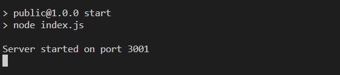
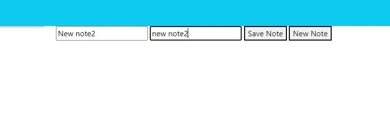
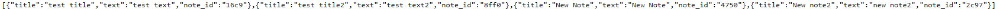

# Note-Taker 2/16/2023

## Description

This project is an note taking application that uses node, javascript, npm, and heroku to run. The user will be welcomed by a home page that displays a button to begin "note taking". This button will then take the user to another "notes" page where they will have the ability to write notes with a title and text as well as delete previous notes.

## Table of Contents

[Badges](#badges)

[Visuals](#visuals)

[Installation](#installation)

[Usage](#usage)

[Support](#support)

[Contribution](#contribution)

[Authors](#authors)

[License](#license)

<a name="badges"/>

## Badges

N/A

<a name="visuals"/>

## Visuals

<a name="installation"/>

## Installation

This project can be cloned from my GitHub repo link found at the bottom of this project's README file. Once installed node, package.json files, and express.js are required to be installed to be able to run this. In the future will also be available via a URL to the Heroku deployment.

Once cloned a command of node install can be run in the terminal to install the necessary dependencies of this project.

<a name="usage"/>

## Usage

This project could be used to produce and run a basic but quality note taking app to remind oneself of tasks that need to be completed.

<a name="support"/>

## Support

N/A

<a name="contribution"/>

## Contributing

The GitHub Repository can be found on the following this link [here.](https://github.com/aguilarj5/Note-Taker.git)

<a name="authors"/>

## Authors and acknowledgment

GitHub: aguilarj5
Node API: https://nodejs.org/api/n-api.html
Express API: https://expressjs.com/en/api.html
Nodemon: https://www.npmjs.com/package/nodemon

<a name="license"/>

## License

N/A
